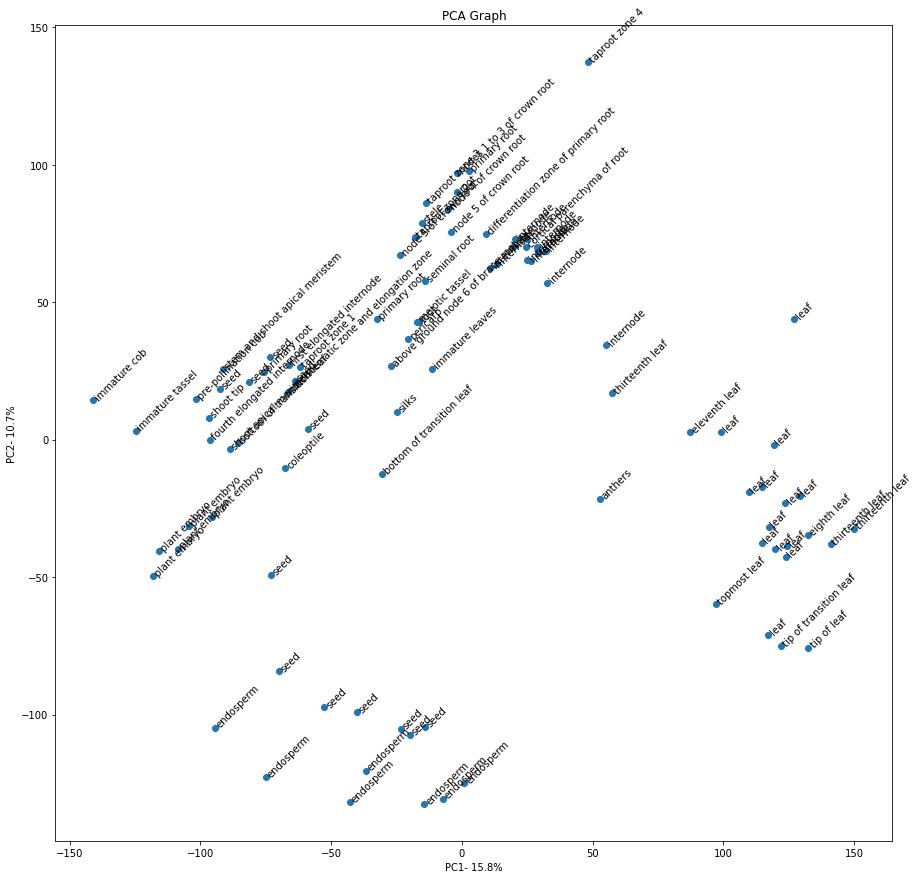

# Life Science Computing

## Aufgabenstellung <a id="task"></a>

> Es wird eine umfassende Analyse eines Datensatzes erwartet. Dazu kann eine Progarmmiersprache eigener Wahl genutzt werden. Die Analyse wird als digitales Textdokument oder als ein <span style="color:blue">(Jupyter) Notebook </span>erstellt.

### Bewertungskriterien: <a id="evaluation-criteria"></a>
 * Korrektheit der Analyse
 * umfassende Datenuntersuchung
 * Beschreibung der Daten
 * Diskussion der Ergebnisse
 * kritische Bewertung der Ergebnisse
 * Einhaltung der Regeln guter wissenschaftlicher Praxis

## Datensatz <a id="dataset"></a>

**"Transcription profiling by high throughput sequencing in different developmental stages of Zea mays subsp. mays tissues"** <br>
Set: RNA-Seq mRNA baseline <br>
Organism: *Zea mays*<br>
Data Source: [Expression Atlas EBI Datensatz](https://www.ebi.ac.uk/gxa/experiments/E-MTAB-4342)


***

# Inhaltsverzeichnis  <a id="toc"></a>

1. [Aufgabenstellung](#task)
    1. [Bewertungskriterien](#evaluation-criteria)
2. [Datensatz](#dataset)
3. [Inhaltsverzeichnis](#toc)
3. [Preparation](#prep)
    1. [Imports](#imports)
    2. [Load Data](#load-data)
4. [Exploring and Processing the Experimental Data](#exploring-exp)
    1. [Print all Columns](#print-cols)
    2. [Check if Columns are equal](#double-cols-exp)
    3. [Delete Data](#del-exp)
    4. [Exploring the Leftover-Data](#expl-leftover-exp)
    5. [<span style="color:orange">Zwischenfazit zu den Experiment-Daten</span> 🏁](#fazit-leftover-exp)
5. [Exploring and Processing the Results](#exploring-results)
    1. [Print all Columns](#print-cols-results)
    2. [Check if Columns are equal](#double-cols-results)
    3. [Delete Data](#del-results)
    4. [Exploring the Leftover-Data](#expl-leftover-results)
    5. [<span style="color:orange">Zwischenfazit zu den Ergebnis-Daten</span> 🏁](#fazit-leftover-results)
    6. [Hauptkomponentenanalyse](#pca)
    7. [<span style="color:orange">Ergebnisse der PCA</span> 🏁](#fazit-pca)


***

# Preparation <a id="prep"></a>

## Imports <a id="imports"></a>


```python
import matplotlib.pyplot as plt
import matplotlib as mpl
import numpy as np
import pandas as pd
```

### Load Data <a id="load-data"></a>


```python
exp_design = pd.read_csv('E-MTAB-4342-experiment-design.tsv', sep='\t', header=0)
results = pd.read_csv('E-MTAB-4342-query-results.fpkms.tsv', sep='\t', header=4)
```

***

# Exploring and Processing the Experimental Data <a id="exploring-exp"></a>

## Print all Columns <a id="print-cols"></a>


```python
exp_design.columns
```


    Index(['Run', 'Sample Characteristic[cultivar]',
           'Sample Characteristic Ontology Term[cultivar]',
           'Sample Characteristic[developmental stage]',
           'Sample Characteristic Ontology Term[developmental stage]',
           'Sample Characteristic[organism]',
           'Sample Characteristic Ontology Term[organism]',
           'Sample Characteristic[organism part]',
           'Sample Characteristic Ontology Term[organism part]',
           'Factor Value[developmental stage]',
           'Factor Value Ontology Term[developmental stage]',
           'Factor Value[organism part]',
           'Factor Value Ontology Term[organism part]', 'Analysed'],
          dtype='object')


## Check if Columns are equal <a id="double-cols-exp"></a>


```python
exp_design['Sample Characteristic Ontology Term[developmental stage]'].equals(exp_design['Factor Value Ontology Term[developmental stage]'])
```


    True


```python
exp_design['Sample Characteristic Ontology Term[organism part]'].equals(exp_design['Factor Value Ontology Term[organism part]'])
```


    True


```python
exp_design['Sample Characteristic[organism part]'].equals(exp_design['Factor Value[organism part]'])
```


    True


```python
exp_design['Sample Characteristic[developmental stage]'].equals(exp_design['Factor Value[developmental stage]'])
```


    True


## Delete Data <a id="del-exp"></a>

### Delete all Columns with less than 2 different Values <a id="del-ununique-exp"></a>


```python
for col in exp_design.columns:
    if len(exp_design[col].unique()) == 1:
        del exp_design[col]
```


```python
exp_design.columns
```


    Index(['Run', 'Sample Characteristic[developmental stage]',
           'Sample Characteristic Ontology Term[developmental stage]',
           'Sample Characteristic[organism part]',
           'Sample Characteristic Ontology Term[organism part]',
           'Factor Value[developmental stage]',
           'Factor Value Ontology Term[developmental stage]',
           'Factor Value[organism part]',
           'Factor Value Ontology Term[organism part]', 'Analysed'],
          dtype='object')


### Delete double Columns <a id="del-dc-exp"></a>


```python
del exp_design['Factor Value Ontology Term[developmental stage]']
del exp_design['Factor Value Ontology Term[organism part]']
del exp_design['Factor Value[organism part]']
del exp_design['Factor Value[developmental stage]']
```

### Delete Sample Characteristic Ontology Columns <a id="del-sco-exp"></a>


```python
del exp_design['Sample Characteristic Ontology Term[developmental stage]']
del exp_design['Sample Characteristic Ontology Term[organism part]']
```

### Delete useless Cols <a id="del-ul-exp"></a>


```python
del exp_design['Analysed']
del exp_design['Run']
```


```python
exp_design = exp_design.rename(columns={"Sample Characteristic[developmental stage]": "developmental stage", "Sample Characteristic[organism part]": "organism part"})
exp_design
```


<div>
<style scoped>
    .dataframe tbody tr th:only-of-type {
        vertical-align: middle;
    }

    .dataframe tbody tr th {
        vertical-align: top;
    }

    .dataframe thead th {
        text-align: right;
    }
</style>
<table border="1" class="dataframe">
  <thead>
    <tr style="text-align: right;">
      <th></th>
      <th>developmental stage</th>
      <th>organism part</th>
    </tr>
  </thead>
  <tbody>
    <tr>
      <th>0</th>
      <td>6 days after pollination</td>
      <td>leaf</td>
    </tr>
    <tr>
      <th>1</th>
      <td>6 days after pollination</td>
      <td>leaf</td>
    </tr>
    <tr>
      <th>2</th>
      <td>6 days after anthesis</td>
      <td>leaf</td>
    </tr>
    <tr>
      <th>3</th>
      <td>12 days after pollination</td>
      <td>leaf</td>
    </tr>
    <tr>
      <th>4</th>
      <td>12 days after pollination</td>
      <td>leaf</td>
    </tr>
    <tr>
      <th>...</th>
      <td>...</td>
      <td>...</td>
    </tr>
    <tr>
      <th>265</th>
      <td>16 days after pollination</td>
      <td>endosperm</td>
    </tr>
    <tr>
      <th>266</th>
      <td>16 days after pollination</td>
      <td>plant embryo</td>
    </tr>
    <tr>
      <th>267</th>
      <td>16 days after pollination</td>
      <td>plant embryo</td>
    </tr>
    <tr>
      <th>268</th>
      <td>16 days after pollination</td>
      <td>plant embryo</td>
    </tr>
    <tr>
      <th>269</th>
      <td>18 days after pollination</td>
      <td>seed</td>
    </tr>
  </tbody>
</table>
<p>270 rows × 2 columns</p>
</div>


## Exploring the Leftover-Data <a id="expl-leftover-exp"></a>


```python
print(exp_design["organism part"].nunique(), exp_design["developmental stage"].nunique())
```

    44 32
    


```python
exp_design.describe()
```


<div>
<style scoped>
    .dataframe tbody tr th:only-of-type {
        vertical-align: middle;
    }

    .dataframe tbody tr th {
        vertical-align: top;
    }

    .dataframe thead th {
        text-align: right;
    }
</style>
<table border="1" class="dataframe">
  <thead>
    <tr style="text-align: right;">
      <th></th>
      <th>developmental stage</th>
      <th>organism part</th>
    </tr>
  </thead>
  <tbody>
    <tr>
      <th>count</th>
      <td>267</td>
      <td>270</td>
    </tr>
    <tr>
      <th>unique</th>
      <td>32</td>
      <td>44</td>
    </tr>
    <tr>
      <th>top</th>
      <td>7 days after sowing</td>
      <td>seed</td>
    </tr>
    <tr>
      <th>freq</th>
      <td>24</td>
      <td>33</td>
    </tr>
  </tbody>
</table>
</div>


## <span style="color:orange">Zwischenfazit zu den Experiment-Daten 🏁</span><a id="fazit-leftover-exp"></a>

### Kultursorte
Um die Ergebnisse nicht aufgrund verschiedenen Genbestands zu verfälschen, wurde eine Inzuchtline der Sorte B73 gezüchtet. Die Inzuchtline stellt sicher, dass der Genbestand aller Probenobjekte gleich ist.
### Probenort / Organismus Teil
Die Expressionsrate sollte außerdem in verschiedenen Teilen des Organismus gemessen werden.</br>
Es wurden 44 verschiedene Abschnitte gemessen. Unter Anderem:
- Blatt
- Internodium
- verschiedene Pfahlwurzelzonen
- Stele
- Hauptwurzel
- Perikarp
- Seminalwurzel

### Entwicklungsstadien 🌱
Das eigentliche Ziel des Versuches war es, die Genexpressionsrate in Abhängigkeit von dem Entwicklungsstadium der Pflanze zu untersuchen. Es wurden 32 verschiedene Entwicklungsstadien untersucht.</br>
Unter Anderem verschiedene Zeitabstände nach:
- Bestäubung
- Anthese
- Aussaat

Außerdem wurde auch die Anzahl der sichbaren Blätter als Stadium eingeteilt und danach unterschieden.</br>
Zusätzlich wurden berücksichtigt:</br>
- Blütephase der ganzen Pflanze
- Stadium der Fruchtbildung der ganzen Pflanze in verschiedenen prozentualen Abschnitten

***

# Exploring and Processing the Results FPKM (Fragments Per Kilobase Million) <a id="exploring-results"></a>


## Print all Columns <a id="print-cols-results"></a>


```python
results
```


<div>
<style scoped>
    .dataframe tbody tr th:only-of-type {
        vertical-align: middle;
    }

    .dataframe tbody tr th {
        vertical-align: top;
    }

    .dataframe thead th {
        text-align: right;
    }
</style>
<table border="1" class="dataframe">
  <thead>
    <tr style="text-align: right;">
      <th></th>
      <th>Gene ID</th>
      <th>Gene Name</th>
      <th>root, 3 days after sowing</th>
      <th>differentiation zone of primary root, 3 days after sowing</th>
      <th>meristematic zone and elongation zone, 3 days after sowing</th>
      <th>stele, 3 days after sowing</th>
      <th>cortical parenchyma of root, 3 days after sowing</th>
      <th>coleoptile, 6 days after sowing</th>
      <th>primary root, 6 days after sowing</th>
      <th>primary root, 7 days after sowing</th>
      <th>...</th>
      <th>seed, 24 days after pollination</th>
      <th>plant embryo, 24 days after pollination</th>
      <th>endosperm, 24 days after pollination</th>
      <th>leaf, 30 days after pollination</th>
      <th>internode, 30 days after pollination</th>
      <th>thirteenth leaf, whole plant fruit formation stage 30 to 50%</th>
      <th>thirteenth leaf, whole plant flowering stage</th>
      <th>pre-pollination cob, whole plant flowering stage</th>
      <th>anthers, whole plant flowering stage</th>
      <th>silks, whole plant flowering stage</th>
    </tr>
  </thead>
  <tbody>
    <tr>
      <th>0</th>
      <td>Zm00001eb000010</td>
      <td>Zm00001eb000010</td>
      <td>2.0</td>
      <td>2.0</td>
      <td>2.0</td>
      <td>2.0</td>
      <td>3.0</td>
      <td>4.0</td>
      <td>3.0</td>
      <td>3.0</td>
      <td>...</td>
      <td>2.0</td>
      <td>5.0</td>
      <td>0.7</td>
      <td>10.0</td>
      <td>6.0</td>
      <td>6.0</td>
      <td>10.0</td>
      <td>7.0</td>
      <td>4.0</td>
      <td>4.0</td>
    </tr>
    <tr>
      <th>1</th>
      <td>Zm00001eb000020</td>
      <td>Zm00001eb000020</td>
      <td>24.0</td>
      <td>15.0</td>
      <td>38.0</td>
      <td>19.0</td>
      <td>11.0</td>
      <td>38.0</td>
      <td>31.0</td>
      <td>20.0</td>
      <td>...</td>
      <td>23.0</td>
      <td>68.0</td>
      <td>14.0</td>
      <td>0.8</td>
      <td>1.0</td>
      <td>0.7</td>
      <td>1.0</td>
      <td>48.0</td>
      <td>17.0</td>
      <td>16.0</td>
    </tr>
    <tr>
      <th>2</th>
      <td>Zm00001eb000030</td>
      <td>Zm00001eb000030</td>
      <td>NaN</td>
      <td>NaN</td>
      <td>NaN</td>
      <td>NaN</td>
      <td>NaN</td>
      <td>0.1</td>
      <td>0.6</td>
      <td>NaN</td>
      <td>...</td>
      <td>0.2</td>
      <td>NaN</td>
      <td>NaN</td>
      <td>0.1</td>
      <td>NaN</td>
      <td>NaN</td>
      <td>NaN</td>
      <td>0.2</td>
      <td>NaN</td>
      <td>NaN</td>
    </tr>
    <tr>
      <th>3</th>
      <td>Zm00001eb000040</td>
      <td>Zm00001eb000040</td>
      <td>NaN</td>
      <td>NaN</td>
      <td>NaN</td>
      <td>0.5</td>
      <td>NaN</td>
      <td>NaN</td>
      <td>0.5</td>
      <td>NaN</td>
      <td>...</td>
      <td>NaN</td>
      <td>NaN</td>
      <td>NaN</td>
      <td>0.1</td>
      <td>0.1</td>
      <td>NaN</td>
      <td>NaN</td>
      <td>0.3</td>
      <td>NaN</td>
      <td>0.1</td>
    </tr>
    <tr>
      <th>4</th>
      <td>Zm00001eb000050</td>
      <td>Zm00001eb000050</td>
      <td>NaN</td>
      <td>NaN</td>
      <td>NaN</td>
      <td>NaN</td>
      <td>NaN</td>
      <td>NaN</td>
      <td>NaN</td>
      <td>NaN</td>
      <td>...</td>
      <td>NaN</td>
      <td>NaN</td>
      <td>NaN</td>
      <td>NaN</td>
      <td>0.2</td>
      <td>NaN</td>
      <td>NaN</td>
      <td>NaN</td>
      <td>NaN</td>
      <td>NaN</td>
    </tr>
    <tr>
      <th>...</th>
      <td>...</td>
      <td>...</td>
      <td>...</td>
      <td>...</td>
      <td>...</td>
      <td>...</td>
      <td>...</td>
      <td>...</td>
      <td>...</td>
      <td>...</td>
      <td>...</td>
      <td>...</td>
      <td>...</td>
      <td>...</td>
      <td>...</td>
      <td>...</td>
      <td>...</td>
      <td>...</td>
      <td>...</td>
      <td>...</td>
      <td>...</td>
    </tr>
    <tr>
      <th>37839</th>
      <td>Zm00001eb442870</td>
      <td>Zm00001eb442870</td>
      <td>NaN</td>
      <td>NaN</td>
      <td>NaN</td>
      <td>NaN</td>
      <td>NaN</td>
      <td>NaN</td>
      <td>NaN</td>
      <td>NaN</td>
      <td>...</td>
      <td>0.2</td>
      <td>NaN</td>
      <td>0.3</td>
      <td>NaN</td>
      <td>NaN</td>
      <td>NaN</td>
      <td>NaN</td>
      <td>NaN</td>
      <td>NaN</td>
      <td>NaN</td>
    </tr>
    <tr>
      <th>37840</th>
      <td>Zm00001eb442890</td>
      <td>Zm00001eb442890</td>
      <td>NaN</td>
      <td>NaN</td>
      <td>NaN</td>
      <td>NaN</td>
      <td>NaN</td>
      <td>0.2</td>
      <td>NaN</td>
      <td>NaN</td>
      <td>...</td>
      <td>0.1</td>
      <td>NaN</td>
      <td>NaN</td>
      <td>NaN</td>
      <td>NaN</td>
      <td>NaN</td>
      <td>NaN</td>
      <td>0.1</td>
      <td>NaN</td>
      <td>NaN</td>
    </tr>
    <tr>
      <th>37841</th>
      <td>Zm00001eb442910</td>
      <td>Zm00001eb442910</td>
      <td>NaN</td>
      <td>NaN</td>
      <td>NaN</td>
      <td>NaN</td>
      <td>NaN</td>
      <td>NaN</td>
      <td>NaN</td>
      <td>NaN</td>
      <td>...</td>
      <td>NaN</td>
      <td>NaN</td>
      <td>NaN</td>
      <td>NaN</td>
      <td>NaN</td>
      <td>NaN</td>
      <td>NaN</td>
      <td>NaN</td>
      <td>NaN</td>
      <td>NaN</td>
    </tr>
    <tr>
      <th>37842</th>
      <td>Zm00001eb442960</td>
      <td>Zm00001eb442960</td>
      <td>NaN</td>
      <td>NaN</td>
      <td>0.2</td>
      <td>NaN</td>
      <td>0.2</td>
      <td>1.0</td>
      <td>0.8</td>
      <td>NaN</td>
      <td>...</td>
      <td>0.4</td>
      <td>1.0</td>
      <td>0.1</td>
      <td>0.4</td>
      <td>0.2</td>
      <td>0.1</td>
      <td>NaN</td>
      <td>0.6</td>
      <td>0.5</td>
      <td>0.5</td>
    </tr>
    <tr>
      <th>37843</th>
      <td>Zm00001eb443030</td>
      <td>Zm00001eb443030</td>
      <td>NaN</td>
      <td>NaN</td>
      <td>NaN</td>
      <td>NaN</td>
      <td>NaN</td>
      <td>NaN</td>
      <td>NaN</td>
      <td>NaN</td>
      <td>...</td>
      <td>NaN</td>
      <td>NaN</td>
      <td>NaN</td>
      <td>NaN</td>
      <td>NaN</td>
      <td>NaN</td>
      <td>NaN</td>
      <td>NaN</td>
      <td>NaN</td>
      <td>NaN</td>
    </tr>
  </tbody>
</table>
<p>37844 rows × 94 columns</p>
</div>


## Check if Columns are equal <a id="double-cols-results"></a>


```python
results['Gene ID'].equals(results['Gene Name'])
```


    True


## Delete Data <a id="del-results"></a>

### Delete double Columns <a id="del-dc-results"></a>


```python
del results['Gene Name']
```


```python
results
```


<div>
<style scoped>
    .dataframe tbody tr th:only-of-type {
        vertical-align: middle;
    }

    .dataframe tbody tr th {
        vertical-align: top;
    }

    .dataframe thead th {
        text-align: right;
    }
</style>
<table border="1" class="dataframe">
  <thead>
    <tr style="text-align: right;">
      <th></th>
      <th>Gene ID</th>
      <th>root, 3 days after sowing</th>
      <th>differentiation zone of primary root, 3 days after sowing</th>
      <th>meristematic zone and elongation zone, 3 days after sowing</th>
      <th>stele, 3 days after sowing</th>
      <th>cortical parenchyma of root, 3 days after sowing</th>
      <th>coleoptile, 6 days after sowing</th>
      <th>primary root, 6 days after sowing</th>
      <th>primary root, 7 days after sowing</th>
      <th>root, 7 days after sowing</th>
      <th>...</th>
      <th>seed, 24 days after pollination</th>
      <th>plant embryo, 24 days after pollination</th>
      <th>endosperm, 24 days after pollination</th>
      <th>leaf, 30 days after pollination</th>
      <th>internode, 30 days after pollination</th>
      <th>thirteenth leaf, whole plant fruit formation stage 30 to 50%</th>
      <th>thirteenth leaf, whole plant flowering stage</th>
      <th>pre-pollination cob, whole plant flowering stage</th>
      <th>anthers, whole plant flowering stage</th>
      <th>silks, whole plant flowering stage</th>
    </tr>
  </thead>
  <tbody>
    <tr>
      <th>0</th>
      <td>Zm00001eb000010</td>
      <td>2.0</td>
      <td>2.0</td>
      <td>2.0</td>
      <td>2.0</td>
      <td>3.0</td>
      <td>4.0</td>
      <td>3.0</td>
      <td>3.0</td>
      <td>3.0</td>
      <td>...</td>
      <td>2.0</td>
      <td>5.0</td>
      <td>0.7</td>
      <td>10.0</td>
      <td>6.0</td>
      <td>6.0</td>
      <td>10.0</td>
      <td>7.0</td>
      <td>4.0</td>
      <td>4.0</td>
    </tr>
    <tr>
      <th>1</th>
      <td>Zm00001eb000020</td>
      <td>24.0</td>
      <td>15.0</td>
      <td>38.0</td>
      <td>19.0</td>
      <td>11.0</td>
      <td>38.0</td>
      <td>31.0</td>
      <td>20.0</td>
      <td>22.0</td>
      <td>...</td>
      <td>23.0</td>
      <td>68.0</td>
      <td>14.0</td>
      <td>0.8</td>
      <td>1.0</td>
      <td>0.7</td>
      <td>1.0</td>
      <td>48.0</td>
      <td>17.0</td>
      <td>16.0</td>
    </tr>
    <tr>
      <th>2</th>
      <td>Zm00001eb000030</td>
      <td>NaN</td>
      <td>NaN</td>
      <td>NaN</td>
      <td>NaN</td>
      <td>NaN</td>
      <td>0.1</td>
      <td>0.6</td>
      <td>NaN</td>
      <td>NaN</td>
      <td>...</td>
      <td>0.2</td>
      <td>NaN</td>
      <td>NaN</td>
      <td>0.1</td>
      <td>NaN</td>
      <td>NaN</td>
      <td>NaN</td>
      <td>0.2</td>
      <td>NaN</td>
      <td>NaN</td>
    </tr>
    <tr>
      <th>3</th>
      <td>Zm00001eb000040</td>
      <td>NaN</td>
      <td>NaN</td>
      <td>NaN</td>
      <td>0.5</td>
      <td>NaN</td>
      <td>NaN</td>
      <td>0.5</td>
      <td>NaN</td>
      <td>NaN</td>
      <td>...</td>
      <td>NaN</td>
      <td>NaN</td>
      <td>NaN</td>
      <td>0.1</td>
      <td>0.1</td>
      <td>NaN</td>
      <td>NaN</td>
      <td>0.3</td>
      <td>NaN</td>
      <td>0.1</td>
    </tr>
    <tr>
      <th>4</th>
      <td>Zm00001eb000050</td>
      <td>NaN</td>
      <td>NaN</td>
      <td>NaN</td>
      <td>NaN</td>
      <td>NaN</td>
      <td>NaN</td>
      <td>NaN</td>
      <td>NaN</td>
      <td>NaN</td>
      <td>...</td>
      <td>NaN</td>
      <td>NaN</td>
      <td>NaN</td>
      <td>NaN</td>
      <td>0.2</td>
      <td>NaN</td>
      <td>NaN</td>
      <td>NaN</td>
      <td>NaN</td>
      <td>NaN</td>
    </tr>
    <tr>
      <th>...</th>
      <td>...</td>
      <td>...</td>
      <td>...</td>
      <td>...</td>
      <td>...</td>
      <td>...</td>
      <td>...</td>
      <td>...</td>
      <td>...</td>
      <td>...</td>
      <td>...</td>
      <td>...</td>
      <td>...</td>
      <td>...</td>
      <td>...</td>
      <td>...</td>
      <td>...</td>
      <td>...</td>
      <td>...</td>
      <td>...</td>
      <td>...</td>
    </tr>
    <tr>
      <th>37839</th>
      <td>Zm00001eb442870</td>
      <td>NaN</td>
      <td>NaN</td>
      <td>NaN</td>
      <td>NaN</td>
      <td>NaN</td>
      <td>NaN</td>
      <td>NaN</td>
      <td>NaN</td>
      <td>NaN</td>
      <td>...</td>
      <td>0.2</td>
      <td>NaN</td>
      <td>0.3</td>
      <td>NaN</td>
      <td>NaN</td>
      <td>NaN</td>
      <td>NaN</td>
      <td>NaN</td>
      <td>NaN</td>
      <td>NaN</td>
    </tr>
    <tr>
      <th>37840</th>
      <td>Zm00001eb442890</td>
      <td>NaN</td>
      <td>NaN</td>
      <td>NaN</td>
      <td>NaN</td>
      <td>NaN</td>
      <td>0.2</td>
      <td>NaN</td>
      <td>NaN</td>
      <td>NaN</td>
      <td>...</td>
      <td>0.1</td>
      <td>NaN</td>
      <td>NaN</td>
      <td>NaN</td>
      <td>NaN</td>
      <td>NaN</td>
      <td>NaN</td>
      <td>0.1</td>
      <td>NaN</td>
      <td>NaN</td>
    </tr>
    <tr>
      <th>37841</th>
      <td>Zm00001eb442910</td>
      <td>NaN</td>
      <td>NaN</td>
      <td>NaN</td>
      <td>NaN</td>
      <td>NaN</td>
      <td>NaN</td>
      <td>NaN</td>
      <td>NaN</td>
      <td>NaN</td>
      <td>...</td>
      <td>NaN</td>
      <td>NaN</td>
      <td>NaN</td>
      <td>NaN</td>
      <td>NaN</td>
      <td>NaN</td>
      <td>NaN</td>
      <td>NaN</td>
      <td>NaN</td>
      <td>NaN</td>
    </tr>
    <tr>
      <th>37842</th>
      <td>Zm00001eb442960</td>
      <td>NaN</td>
      <td>NaN</td>
      <td>0.2</td>
      <td>NaN</td>
      <td>0.2</td>
      <td>1.0</td>
      <td>0.8</td>
      <td>NaN</td>
      <td>0.3</td>
      <td>...</td>
      <td>0.4</td>
      <td>1.0</td>
      <td>0.1</td>
      <td>0.4</td>
      <td>0.2</td>
      <td>0.1</td>
      <td>NaN</td>
      <td>0.6</td>
      <td>0.5</td>
      <td>0.5</td>
    </tr>
    <tr>
      <th>37843</th>
      <td>Zm00001eb443030</td>
      <td>NaN</td>
      <td>NaN</td>
      <td>NaN</td>
      <td>NaN</td>
      <td>NaN</td>
      <td>NaN</td>
      <td>NaN</td>
      <td>NaN</td>
      <td>NaN</td>
      <td>...</td>
      <td>NaN</td>
      <td>NaN</td>
      <td>NaN</td>
      <td>NaN</td>
      <td>NaN</td>
      <td>NaN</td>
      <td>NaN</td>
      <td>NaN</td>
      <td>NaN</td>
      <td>NaN</td>
    </tr>
  </tbody>
</table>
<p>37844 rows × 93 columns</p>
</div>


## Exploring the Leftover-Data <a id="expl-leftover-results"></a>

### Data: **After Sowing**


```python
after_sowing = results.filter(
    regex='days after sowing')
after_sowing
```


<div>
<style scoped>
    .dataframe tbody tr th:only-of-type {
        vertical-align: middle;
    }

    .dataframe tbody tr th {
        vertical-align: top;
    }

    .dataframe thead th {
        text-align: right;
    }
</style>
<table border="1" class="dataframe">
  <thead>
    <tr style="text-align: right;">
      <th></th>
      <th>root, 3 days after sowing</th>
      <th>differentiation zone of primary root, 3 days after sowing</th>
      <th>meristematic zone and elongation zone, 3 days after sowing</th>
      <th>stele, 3 days after sowing</th>
      <th>cortical parenchyma of root, 3 days after sowing</th>
      <th>coleoptile, 6 days after sowing</th>
      <th>primary root, 6 days after sowing</th>
      <th>primary root, 7 days after sowing</th>
      <th>root, 7 days after sowing</th>
      <th>seminal root, 7 days after sowing</th>
      <th>taproot zone 1, 7 days after sowing</th>
      <th>taproot zone 2, 7 days after sowing</th>
      <th>taproot zone 3, 7 days after sowing</th>
      <th>taproot zone 4, 7 days after sowing</th>
    </tr>
  </thead>
  <tbody>
    <tr>
      <th>0</th>
      <td>2.0</td>
      <td>2.0</td>
      <td>2.0</td>
      <td>2.0</td>
      <td>3.0</td>
      <td>4.0</td>
      <td>3.0</td>
      <td>3.0</td>
      <td>3.0</td>
      <td>2.0</td>
      <td>3.0</td>
      <td>4.0</td>
      <td>4.0</td>
      <td>4.0</td>
    </tr>
    <tr>
      <th>1</th>
      <td>24.0</td>
      <td>15.0</td>
      <td>38.0</td>
      <td>19.0</td>
      <td>11.0</td>
      <td>38.0</td>
      <td>31.0</td>
      <td>20.0</td>
      <td>22.0</td>
      <td>27.0</td>
      <td>47.0</td>
      <td>29.0</td>
      <td>23.0</td>
      <td>5.0</td>
    </tr>
    <tr>
      <th>2</th>
      <td>NaN</td>
      <td>NaN</td>
      <td>NaN</td>
      <td>NaN</td>
      <td>NaN</td>
      <td>0.1</td>
      <td>0.6</td>
      <td>NaN</td>
      <td>NaN</td>
      <td>NaN</td>
      <td>0.1</td>
      <td>NaN</td>
      <td>NaN</td>
      <td>NaN</td>
    </tr>
    <tr>
      <th>3</th>
      <td>NaN</td>
      <td>NaN</td>
      <td>NaN</td>
      <td>0.5</td>
      <td>NaN</td>
      <td>NaN</td>
      <td>0.5</td>
      <td>NaN</td>
      <td>NaN</td>
      <td>NaN</td>
      <td>0.4</td>
      <td>0.2</td>
      <td>NaN</td>
      <td>NaN</td>
    </tr>
    <tr>
      <th>4</th>
      <td>NaN</td>
      <td>NaN</td>
      <td>NaN</td>
      <td>NaN</td>
      <td>NaN</td>
      <td>NaN</td>
      <td>NaN</td>
      <td>NaN</td>
      <td>NaN</td>
      <td>NaN</td>
      <td>NaN</td>
      <td>NaN</td>
      <td>NaN</td>
      <td>NaN</td>
    </tr>
    <tr>
      <th>...</th>
      <td>...</td>
      <td>...</td>
      <td>...</td>
      <td>...</td>
      <td>...</td>
      <td>...</td>
      <td>...</td>
      <td>...</td>
      <td>...</td>
      <td>...</td>
      <td>...</td>
      <td>...</td>
      <td>...</td>
      <td>...</td>
    </tr>
    <tr>
      <th>37839</th>
      <td>NaN</td>
      <td>NaN</td>
      <td>NaN</td>
      <td>NaN</td>
      <td>NaN</td>
      <td>NaN</td>
      <td>NaN</td>
      <td>NaN</td>
      <td>NaN</td>
      <td>NaN</td>
      <td>NaN</td>
      <td>NaN</td>
      <td>NaN</td>
      <td>NaN</td>
    </tr>
    <tr>
      <th>37840</th>
      <td>NaN</td>
      <td>NaN</td>
      <td>NaN</td>
      <td>NaN</td>
      <td>NaN</td>
      <td>0.2</td>
      <td>NaN</td>
      <td>NaN</td>
      <td>NaN</td>
      <td>NaN</td>
      <td>NaN</td>
      <td>NaN</td>
      <td>NaN</td>
      <td>NaN</td>
    </tr>
    <tr>
      <th>37841</th>
      <td>NaN</td>
      <td>NaN</td>
      <td>NaN</td>
      <td>NaN</td>
      <td>NaN</td>
      <td>NaN</td>
      <td>NaN</td>
      <td>NaN</td>
      <td>NaN</td>
      <td>NaN</td>
      <td>NaN</td>
      <td>NaN</td>
      <td>NaN</td>
      <td>NaN</td>
    </tr>
    <tr>
      <th>37842</th>
      <td>NaN</td>
      <td>NaN</td>
      <td>0.2</td>
      <td>NaN</td>
      <td>0.2</td>
      <td>1.0</td>
      <td>0.8</td>
      <td>NaN</td>
      <td>0.3</td>
      <td>0.3</td>
      <td>NaN</td>
      <td>NaN</td>
      <td>0.2</td>
      <td>NaN</td>
    </tr>
    <tr>
      <th>37843</th>
      <td>NaN</td>
      <td>NaN</td>
      <td>NaN</td>
      <td>NaN</td>
      <td>NaN</td>
      <td>NaN</td>
      <td>NaN</td>
      <td>NaN</td>
      <td>NaN</td>
      <td>NaN</td>
      <td>NaN</td>
      <td>NaN</td>
      <td>NaN</td>
      <td>NaN</td>
    </tr>
  </tbody>
</table>
<p>37844 rows × 14 columns</p>
</div>


#### Calculate how many Genes where not expressed after sowing compared to Total


```python
len_all = len(results.index)

after_sowing = after_sowing.dropna(axis=0, how='all')
len_sowing = len(after_sowing.index)
print(len_all- len_sowing)
```

    7213
    

#### Count how many Genes where expressed after sowing by days after sowing and Organism Part


```python
after_sowing.count()
```


    root, 3 days after sowing                                     24582
    differentiation zone of primary root, 3 days after sowing     24787
    meristematic zone and elongation zone, 3 days after sowing    22893
    stele, 3 days after sowing                                    23762
    cortical parenchyma of root, 3 days after sowing              25025
    coleoptile, 6 days after sowing                               25759
    primary root, 6 days after sowing                             25631
    primary root, 7 days after sowing                             26315
    root, 7 days after sowing                                     26103
    seminal root, 7 days after sowing                             25064
    taproot zone 1, 7 days after sowing                           23977
    taproot zone 2, 7 days after sowing                           25058
    taproot zone 3, 7 days after sowing                           25998
    taproot zone 4, 7 days after sowing                           26809
    dtype: int64


---

### Data: **After Pollination**


```python
after_pollination = results.filter(
    regex='days after pollination')
after_pollination
```


<div>
<style scoped>
    .dataframe tbody tr th:only-of-type {
        vertical-align: middle;
    }

    .dataframe tbody tr th {
        vertical-align: top;
    }

    .dataframe thead th {
        text-align: right;
    }
</style>
<table border="1" class="dataframe">
  <thead>
    <tr style="text-align: right;">
      <th></th>
      <th>seed, 2 days after pollination</th>
      <th>seed, 4 days after pollination</th>
      <th>leaf, 6 days after pollination</th>
      <th>internode, 6 days after pollination</th>
      <th>seed, 6 days after pollination</th>
      <th>seed, 8 days after pollination</th>
      <th>seed, 10 days after pollination</th>
      <th>leaf, 12 days after pollination</th>
      <th>internode, 12 days after pollination</th>
      <th>seed, 12 days after pollination</th>
      <th>...</th>
      <th>seed, 22 days after pollination</th>
      <th>plant embryo, 22 days after pollination</th>
      <th>endosperm, 22 days after pollination</th>
      <th>leaf, 24 days after pollination</th>
      <th>internode, 24 days after pollination</th>
      <th>seed, 24 days after pollination</th>
      <th>plant embryo, 24 days after pollination</th>
      <th>endosperm, 24 days after pollination</th>
      <th>leaf, 30 days after pollination</th>
      <th>internode, 30 days after pollination</th>
    </tr>
  </thead>
  <tbody>
    <tr>
      <th>0</th>
      <td>5.0</td>
      <td>6.0</td>
      <td>14.0</td>
      <td>11.0</td>
      <td>5.0</td>
      <td>4.0</td>
      <td>4.0</td>
      <td>12.0</td>
      <td>6.0</td>
      <td>3.0</td>
      <td>...</td>
      <td>2.0</td>
      <td>5.0</td>
      <td>0.9</td>
      <td>9.0</td>
      <td>7.0</td>
      <td>2.0</td>
      <td>5.0</td>
      <td>0.7</td>
      <td>10.0</td>
      <td>6.0</td>
    </tr>
    <tr>
      <th>1</th>
      <td>42.0</td>
      <td>40.0</td>
      <td>0.9</td>
      <td>2.0</td>
      <td>30.0</td>
      <td>29.0</td>
      <td>28.0</td>
      <td>0.6</td>
      <td>4.0</td>
      <td>41.0</td>
      <td>...</td>
      <td>25.0</td>
      <td>84.0</td>
      <td>15.0</td>
      <td>0.7</td>
      <td>1.0</td>
      <td>23.0</td>
      <td>68.0</td>
      <td>14.0</td>
      <td>0.8</td>
      <td>1.0</td>
    </tr>
    <tr>
      <th>2</th>
      <td>NaN</td>
      <td>0.2</td>
      <td>0.4</td>
      <td>NaN</td>
      <td>0.2</td>
      <td>NaN</td>
      <td>0.1</td>
      <td>NaN</td>
      <td>NaN</td>
      <td>NaN</td>
      <td>...</td>
      <td>0.1</td>
      <td>NaN</td>
      <td>NaN</td>
      <td>0.3</td>
      <td>0.6</td>
      <td>0.2</td>
      <td>NaN</td>
      <td>NaN</td>
      <td>0.1</td>
      <td>NaN</td>
    </tr>
    <tr>
      <th>3</th>
      <td>0.2</td>
      <td>0.1</td>
      <td>NaN</td>
      <td>NaN</td>
      <td>0.1</td>
      <td>0.1</td>
      <td>0.1</td>
      <td>0.1</td>
      <td>NaN</td>
      <td>NaN</td>
      <td>...</td>
      <td>NaN</td>
      <td>NaN</td>
      <td>NaN</td>
      <td>NaN</td>
      <td>0.1</td>
      <td>NaN</td>
      <td>NaN</td>
      <td>NaN</td>
      <td>0.1</td>
      <td>0.1</td>
    </tr>
    <tr>
      <th>4</th>
      <td>0.1</td>
      <td>NaN</td>
      <td>NaN</td>
      <td>NaN</td>
      <td>0.1</td>
      <td>NaN</td>
      <td>NaN</td>
      <td>NaN</td>
      <td>NaN</td>
      <td>NaN</td>
      <td>...</td>
      <td>NaN</td>
      <td>NaN</td>
      <td>NaN</td>
      <td>NaN</td>
      <td>NaN</td>
      <td>NaN</td>
      <td>NaN</td>
      <td>NaN</td>
      <td>NaN</td>
      <td>0.2</td>
    </tr>
    <tr>
      <th>...</th>
      <td>...</td>
      <td>...</td>
      <td>...</td>
      <td>...</td>
      <td>...</td>
      <td>...</td>
      <td>...</td>
      <td>...</td>
      <td>...</td>
      <td>...</td>
      <td>...</td>
      <td>...</td>
      <td>...</td>
      <td>...</td>
      <td>...</td>
      <td>...</td>
      <td>...</td>
      <td>...</td>
      <td>...</td>
      <td>...</td>
      <td>...</td>
    </tr>
    <tr>
      <th>37839</th>
      <td>NaN</td>
      <td>NaN</td>
      <td>NaN</td>
      <td>NaN</td>
      <td>NaN</td>
      <td>NaN</td>
      <td>NaN</td>
      <td>NaN</td>
      <td>NaN</td>
      <td>NaN</td>
      <td>...</td>
      <td>NaN</td>
      <td>NaN</td>
      <td>0.2</td>
      <td>NaN</td>
      <td>NaN</td>
      <td>0.2</td>
      <td>NaN</td>
      <td>0.3</td>
      <td>NaN</td>
      <td>NaN</td>
    </tr>
    <tr>
      <th>37840</th>
      <td>0.2</td>
      <td>NaN</td>
      <td>NaN</td>
      <td>NaN</td>
      <td>NaN</td>
      <td>NaN</td>
      <td>0.2</td>
      <td>NaN</td>
      <td>NaN</td>
      <td>NaN</td>
      <td>...</td>
      <td>0.2</td>
      <td>NaN</td>
      <td>0.3</td>
      <td>NaN</td>
      <td>NaN</td>
      <td>0.1</td>
      <td>NaN</td>
      <td>NaN</td>
      <td>NaN</td>
      <td>NaN</td>
    </tr>
    <tr>
      <th>37841</th>
      <td>NaN</td>
      <td>NaN</td>
      <td>NaN</td>
      <td>NaN</td>
      <td>NaN</td>
      <td>NaN</td>
      <td>NaN</td>
      <td>NaN</td>
      <td>NaN</td>
      <td>NaN</td>
      <td>...</td>
      <td>NaN</td>
      <td>NaN</td>
      <td>NaN</td>
      <td>NaN</td>
      <td>NaN</td>
      <td>NaN</td>
      <td>NaN</td>
      <td>NaN</td>
      <td>NaN</td>
      <td>NaN</td>
    </tr>
    <tr>
      <th>37842</th>
      <td>2.0</td>
      <td>3.0</td>
      <td>0.4</td>
      <td>0.3</td>
      <td>3.0</td>
      <td>2.0</td>
      <td>2.0</td>
      <td>0.2</td>
      <td>NaN</td>
      <td>0.8</td>
      <td>...</td>
      <td>0.4</td>
      <td>2.0</td>
      <td>0.2</td>
      <td>0.1</td>
      <td>0.2</td>
      <td>0.4</td>
      <td>1.0</td>
      <td>0.1</td>
      <td>0.4</td>
      <td>0.2</td>
    </tr>
    <tr>
      <th>37843</th>
      <td>NaN</td>
      <td>NaN</td>
      <td>NaN</td>
      <td>NaN</td>
      <td>NaN</td>
      <td>NaN</td>
      <td>NaN</td>
      <td>NaN</td>
      <td>NaN</td>
      <td>NaN</td>
      <td>...</td>
      <td>NaN</td>
      <td>NaN</td>
      <td>NaN</td>
      <td>0.1</td>
      <td>NaN</td>
      <td>NaN</td>
      <td>NaN</td>
      <td>NaN</td>
      <td>NaN</td>
      <td>NaN</td>
    </tr>
  </tbody>
</table>
<p>37844 rows × 35 columns</p>
</div>


#### Calculate how many Genes where not expressed after pollination compared to Total


```python
len_all = len(results.index)

after_pollination = after_pollination.dropna(axis=0, how='all')
len_pollination = len(after_pollination.index)
print(len_all- len_pollination)
```

    2077
    

#### Calculate how many more Genes where expressed compared to sowing


```python
print(len_pollination - len_sowing)
```

    5136
    

#### Count how many Genes where expressed after pollination by days after pollination and Organism Part


```python
after_pollination.count()
```


    seed, 2 days after pollination             26907
    seed, 4 days after pollination             27090
    leaf, 6 days after pollination             26035
    internode, 6 days after pollination        25390
    seed, 6 days after pollination             26935
    seed, 8 days after pollination             27191
    seed, 10 days after pollination            27919
    leaf, 12 days after pollination            25413
    internode, 12 days after pollination       26289
    seed, 12 days after pollination            25672
    endosperm, 12 days after pollination       24969
    seed, 14 days after pollination            26669
    endosperm, 14 days after pollination       23174
    seed, 16 days after pollination            25538
    plant embryo, 16 days after pollination    24076
    endosperm, 16 days after pollination       22740
    leaf, 18 days after pollination            25620
    internode, 18 days after pollination       25385
    seed, 18 days after pollination            26032
    plant embryo, 18 days after pollination    25016
    endosperm, 18 days after pollination       24444
    pericarp, 18 days after pollination        25738
    seed, 20 days after pollination            26429
    plant embryo, 20 days after pollination    24794
    endosperm, 20 days after pollination       23508
    seed, 22 days after pollination            26463
    plant embryo, 22 days after pollination    24485
    endosperm, 22 days after pollination       23009
    leaf, 24 days after pollination            25702
    internode, 24 days after pollination       25442
    seed, 24 days after pollination            26432
    plant embryo, 24 days after pollination    25769
    endosperm, 24 days after pollination       22742
    leaf, 30 days after pollination            26485
    internode, 30 days after pollination       25341
    dtype: int64


#### Compare Genes from Leaf by Days


```python
after_pollination.filter(
    regex='leaf').count()

```


    leaf, 6 days after pollination     26035
    leaf, 12 days after pollination    25413
    leaf, 18 days after pollination    25620
    leaf, 24 days after pollination    25702
    leaf, 30 days after pollination    26485
    dtype: int64


#### Compare Genes from Endosperm by Days


```python
after_pollination.filter(
    regex='endosperm').count()

```


    endosperm, 12 days after pollination    24969
    endosperm, 14 days after pollination    23174
    endosperm, 16 days after pollination    22740
    endosperm, 18 days after pollination    24444
    endosperm, 20 days after pollination    23508
    endosperm, 22 days after pollination    23009
    endosperm, 24 days after pollination    22742
    dtype: int64


## <span style="color:orange">Zwischenfazit zu den Ergebnis-Daten 🏁</span><a id="fazit-leftover-results"></a>

### Nach der Aussaat
Die Messungen der Genexpression wurden an mehreren Tagen durchgeführt.
Jeweils 3, 6 und 7 Tage nach der Aussaat.

Die Probenentnahme 3 Tage nach der Aussaat erfolgte an folgenden Organismus-Teilen:
- Wurzel
- Differenzierungszone der Primärwurzel
- meristematische Zone und Streckungszone
- Stele
- Rindenparenchym der Wurzel

Am 6. Tag nach der Aussat wurden folgende Teile untersucht:
- Koleoptile
- Primärwurzel

Einen weiteren Tag später fanden die letzten Messungen dieses Entwicklungsstadiums in folgenden Teilen statt:
- Primärwurzel
- Wurzel
- Seminalwurzel
- Pfahlwurzel Zonen 1 - 4

Nach der Aussaat wurden 7213 Gene weniger expremiert, verglichen mit allen Wachstumsstadien in Summe.<br>
Mit Anzahl der Tage nach Aussaat stieg außerdem die Anzahl der expr. Gene.<br>
Nach 3 Tagen lag die Anzahl bei 22893 - 25025, bei 6 Tagen bei 25631-25759 und bei 7 Tagen bei 23977-26809.<br>
Es ist ein deutlicher Anstieg erkennbar. Unklar ist, ob dieser tatsächlich durch die Anzahl vergangener Tage und somit durch die Wachstumsphase bedingt ist, oder auf die unterschiedlichen Probenentnahmeorte zurückzuführen ist.<br>
Zwei Proben wurden an verschiedenen Tagen in der selben Zone entnommen. Diese legen die Vermutung nahe, dass die höhere Anzahl der Tage nach Aussaat zu einer höheren Expremierung führt.
Bei den Proben handelt es sich um die folgenden:

| **Tag** | **Primärwurzel** | **Wurzel** |
|:-------:|:----------------:|:----------:|
|    3    |                  |    24582   |
|    6    |       25631      |            |
|    7    |       26315      |    26103   |


### Nach der Bestäubung
Die Messungen wurden nach der Bestäubung jeweils im Abstand von 2 Tagen, bis Tag 30 durchgeführt.
Mit fortschreitendem Wachstumsstadium wurden die Messungen auch an verschiedenen Orten durchgeführt.
Getestet wurden z.B.:
- Samen
- Blatt
- Internodium
- Endosperm
- Pflanzenembryo
- Perikarp

Verglichen mit der Aussaat wurden 5136 Gene mehr exprimiert.
Die Anzahl der exprimierten Gene scheint hier keinen direkten Zusammenhang mit der Anzahl vergangener Tage im Entwicklungsstadium zu haben. Dies lässt sich aber nicht sicher sagen, da an verschiedenen Orten die Proben entnommen wurden.<br>
Die Proben der Blätter wurden im regelmäßigen Abstand von 6 Tagen genommen. Die Daten zeigen hier, dass es keinen linearen Zusammenhang gibt.

| **Tage nach der Bestäubung** | **Anzahl exprimierter Gene** |
|:----------------------------:|:----------------------------:|
|               6              |             26035            |
|              12              |             25413            |
|              18              |             25620            |
|              24              |             25702            |
|              30              |             26485            |


Um sicher zu gehen, dass dies nicht nur eine Eigenschaft der Blätter ist, habe ich zusätzlich die Daten des Endosperms tageweise gefiltert. Auch hier zeigt sich, dass es keinen linearen Zusammenhang gibt.

| **Tage nach der Bestäubung** | **Anzahl exprimierter Gene** |
|:----------------------------:|:----------------------------:|
|              12              |             24969            |
|              14              |             23174            |
|              16              |             22740            |
|              18              |             24444            |
|              20              |             23508            |
| 22                           |             23009            |
| 24                           |             22742            |


---


```python
import numpy as np
from pandas import DataFrame
import seaborn as sns
# %matplotlib inline
results = results.fillna(0)
results.set_index('Gene ID', inplace=True)
```


```python
endosperm_after_pollination = after_pollination.filter(regex='endosperm')
endosperm_after_pollination.columns = endosperm_after_pollination.columns.str.replace("days after pollination", "")
endosperm_after_pollination.columns = endosperm_after_pollination.columns.str.replace("endosperm, ", "")


seed_after_pollination = after_pollination.filter(regex='seed')
seed_after_pollination.columns = seed_after_pollination.columns.str.replace("days after pollination", "")
seed_after_pollination.columns = seed_after_pollination.columns.str.replace("seed, ", "")


leaf_after_pollination = after_pollination.filter(regex='leaf')
leaf_after_pollination.columns = leaf_after_pollination.columns.str.replace("days after pollination", "")
leaf_after_pollination.columns = leaf_after_pollination.columns.str.replace("leaf, ", "")

internode_after_pollination = after_pollination.filter(regex='internode')
internode_after_pollination.columns = internode_after_pollination.columns.str.replace("days after pollination", "")
internode_after_pollination.columns = internode_after_pollination.columns.str.replace("internode, ", "")

plant_embryo_after_pollination = after_pollination.filter(regex='plant embryo')
plant_embryo_after_pollination.columns = plant_embryo_after_pollination.columns.str.replace("days after pollination", "")
plant_embryo_after_pollination.columns = plant_embryo_after_pollination.columns.str.replace("plant embryo, ", "")

pericarp_after_pollination = after_pollination.filter(regex='pericarp')
pericarp_after_pollination.columns = pericarp_after_pollination.columns.str.replace("days after pollination", "")
pericarp_after_pollination.columns = pericarp_after_pollination.columns.str.replace("pericarp, ", "")


seed_after_pollination
```


<div>
<style scoped>
    .dataframe tbody tr th:only-of-type {
        vertical-align: middle;
    }

    .dataframe tbody tr th {
        vertical-align: top;
    }

    .dataframe thead th {
        text-align: right;
    }
</style>
<table border="1" class="dataframe">
  <thead>
    <tr style="text-align: right;">
      <th></th>
      <th>2</th>
      <th>4</th>
      <th>6</th>
      <th>8</th>
      <th>10</th>
      <th>12</th>
      <th>14</th>
      <th>16</th>
      <th>18</th>
      <th>20</th>
      <th>22</th>
      <th>24</th>
    </tr>
  </thead>
  <tbody>
    <tr>
      <th>0</th>
      <td>5.0</td>
      <td>6.0</td>
      <td>5.0</td>
      <td>4.0</td>
      <td>4.0</td>
      <td>3.0</td>
      <td>3.0</td>
      <td>2.0</td>
      <td>2.0</td>
      <td>1.0</td>
      <td>2.0</td>
      <td>2.0</td>
    </tr>
    <tr>
      <th>1</th>
      <td>42.0</td>
      <td>40.0</td>
      <td>30.0</td>
      <td>29.0</td>
      <td>28.0</td>
      <td>41.0</td>
      <td>31.0</td>
      <td>23.0</td>
      <td>23.0</td>
      <td>19.0</td>
      <td>25.0</td>
      <td>23.0</td>
    </tr>
    <tr>
      <th>2</th>
      <td>NaN</td>
      <td>0.2</td>
      <td>0.2</td>
      <td>NaN</td>
      <td>0.1</td>
      <td>NaN</td>
      <td>0.1</td>
      <td>NaN</td>
      <td>NaN</td>
      <td>NaN</td>
      <td>0.1</td>
      <td>0.2</td>
    </tr>
    <tr>
      <th>3</th>
      <td>0.2</td>
      <td>0.1</td>
      <td>0.1</td>
      <td>0.1</td>
      <td>0.1</td>
      <td>NaN</td>
      <td>NaN</td>
      <td>NaN</td>
      <td>0.2</td>
      <td>0.1</td>
      <td>NaN</td>
      <td>NaN</td>
    </tr>
    <tr>
      <th>4</th>
      <td>0.1</td>
      <td>NaN</td>
      <td>0.1</td>
      <td>NaN</td>
      <td>NaN</td>
      <td>NaN</td>
      <td>NaN</td>
      <td>NaN</td>
      <td>NaN</td>
      <td>NaN</td>
      <td>NaN</td>
      <td>NaN</td>
    </tr>
    <tr>
      <th>...</th>
      <td>...</td>
      <td>...</td>
      <td>...</td>
      <td>...</td>
      <td>...</td>
      <td>...</td>
      <td>...</td>
      <td>...</td>
      <td>...</td>
      <td>...</td>
      <td>...</td>
      <td>...</td>
    </tr>
    <tr>
      <th>37838</th>
      <td>NaN</td>
      <td>NaN</td>
      <td>NaN</td>
      <td>NaN</td>
      <td>NaN</td>
      <td>NaN</td>
      <td>NaN</td>
      <td>NaN</td>
      <td>NaN</td>
      <td>NaN</td>
      <td>NaN</td>
      <td>NaN</td>
    </tr>
    <tr>
      <th>37839</th>
      <td>NaN</td>
      <td>NaN</td>
      <td>NaN</td>
      <td>NaN</td>
      <td>NaN</td>
      <td>NaN</td>
      <td>NaN</td>
      <td>NaN</td>
      <td>NaN</td>
      <td>NaN</td>
      <td>NaN</td>
      <td>0.2</td>
    </tr>
    <tr>
      <th>37840</th>
      <td>0.2</td>
      <td>NaN</td>
      <td>NaN</td>
      <td>NaN</td>
      <td>0.2</td>
      <td>NaN</td>
      <td>0.5</td>
      <td>NaN</td>
      <td>0.2</td>
      <td>0.1</td>
      <td>0.2</td>
      <td>0.1</td>
    </tr>
    <tr>
      <th>37842</th>
      <td>2.0</td>
      <td>3.0</td>
      <td>3.0</td>
      <td>2.0</td>
      <td>2.0</td>
      <td>0.8</td>
      <td>1.0</td>
      <td>0.3</td>
      <td>0.5</td>
      <td>0.4</td>
      <td>0.4</td>
      <td>0.4</td>
    </tr>
    <tr>
      <th>37843</th>
      <td>NaN</td>
      <td>NaN</td>
      <td>NaN</td>
      <td>NaN</td>
      <td>NaN</td>
      <td>NaN</td>
      <td>NaN</td>
      <td>NaN</td>
      <td>NaN</td>
      <td>NaN</td>
      <td>NaN</td>
      <td>NaN</td>
    </tr>
  </tbody>
</table>
<p>35767 rows × 12 columns</p>
</div>


# Hauptkomponentenanalyse <a id="pca">


```python
from sklearn.decomposition import PCA
from sklearn import preprocessing
import matplotlib.pyplot as plt
```


```python
scaled_data = preprocessing.scale(results.T)
pca = PCA()
pca.fit(scaled_data)
pca_data = pca.transform(scaled_data)

per_var = np.round(pca.explained_variance_ratio_ * 100, decimals=1)
labels = ['PC' + str(x) for x in range(1, len(per_var)+1)]

plt.bar(x=range(1,len(per_var)+1), height=per_var, tick_label=labels)
plt.ylabel('Percentage of Explained Variance')
plt.xlabel('Principal Component')
plt.xticks(rotation=90)
plt.title('Scree Plot')
plt.show()
```


    

    


**Ergebnis**: Die ersten 2 Hauptkomponenten bilden nahezu ausschließlich die Varianzen ab


```python
pca_df = pd.DataFrame(pca_data, columns=labels, index=results.columns)

plt.rcParams["figure.figsize"] = (15,15)
plt.scatter(pca_df.PC1, pca_df.PC2)
plt.title('PCA Graph')
plt.xlabel(f'PC1- {per_var[0]}%')
plt.ylabel(f'PC2- {per_var[1]}%')

pca_df
for sample in pca_df.index:
    plt.annotate(sample.partition(',')[0], (pca_df.PC1.loc[sample], pca_df.PC2.loc[sample]),  rotation=45)
    

plt.show()
```


    

    


## Find Top 10 PCA seperating Genes <a id="pca-top10">


```python
loading_scores = pd.Series(pca.components_[0], index=results.index)
sorted_loading_scores = loading_scores.abs().sort_values(ascending=False)
top_10_genes = sorted_loading_scores[0:10].index.values
loading_scores[top_10_genes]
```


    Gene ID
    Zm00001eb059170   -0.012067
    Zm00001eb246940   -0.012066
    Zm00001eb216140   -0.012039
    Zm00001eb077390   -0.012038
    Zm00001eb423880   -0.012003
    Zm00001eb301640   -0.011932
    Zm00001eb077380   -0.011899
    Zm00001eb232720   -0.011895
    Zm00001eb395490   -0.011878
    Zm00001eb285560   -0.011875
    dtype: float64


### Show the Dataframe rows with the top 3 Genes to prove the PCA


```python
df = results.loc[["Zm00001eb059170", "Zm00001eb246940", "Zm00001eb216140"]]
df
```


<div>
<style scoped>
    .dataframe tbody tr th:only-of-type {
        vertical-align: middle;
    }

    .dataframe tbody tr th {
        vertical-align: top;
    }

    .dataframe thead th {
        text-align: right;
    }
</style>
<table border="1" class="dataframe">
  <thead>
    <tr style="text-align: right;">
      <th></th>
      <th>root, 3 days after sowing</th>
      <th>differentiation zone of primary root, 3 days after sowing</th>
      <th>meristematic zone and elongation zone, 3 days after sowing</th>
      <th>stele, 3 days after sowing</th>
      <th>cortical parenchyma of root, 3 days after sowing</th>
      <th>coleoptile, 6 days after sowing</th>
      <th>primary root, 6 days after sowing</th>
      <th>primary root, 7 days after sowing</th>
      <th>root, 7 days after sowing</th>
      <th>seminal root, 7 days after sowing</th>
      <th>...</th>
      <th>seed, 24 days after pollination</th>
      <th>plant embryo, 24 days after pollination</th>
      <th>endosperm, 24 days after pollination</th>
      <th>leaf, 30 days after pollination</th>
      <th>internode, 30 days after pollination</th>
      <th>thirteenth leaf, whole plant fruit formation stage 30 to 50%</th>
      <th>thirteenth leaf, whole plant flowering stage</th>
      <th>pre-pollination cob, whole plant flowering stage</th>
      <th>anthers, whole plant flowering stage</th>
      <th>silks, whole plant flowering stage</th>
    </tr>
    <tr>
      <th>Gene ID</th>
      <th></th>
      <th></th>
      <th></th>
      <th></th>
      <th></th>
      <th></th>
      <th></th>
      <th></th>
      <th></th>
      <th></th>
      <th></th>
      <th></th>
      <th></th>
      <th></th>
      <th></th>
      <th></th>
      <th></th>
      <th></th>
      <th></th>
      <th></th>
      <th></th>
    </tr>
  </thead>
  <tbody>
    <tr>
      <th>Zm00001eb059170</th>
      <td>10.0</td>
      <td>10.0</td>
      <td>15.0</td>
      <td>11.0</td>
      <td>9.0</td>
      <td>13.0</td>
      <td>8.0</td>
      <td>11.0</td>
      <td>11.0</td>
      <td>14.0</td>
      <td>...</td>
      <td>10.0</td>
      <td>20.0</td>
      <td>7.0</td>
      <td>4.0</td>
      <td>11.0</td>
      <td>2.0</td>
      <td>1.0</td>
      <td>18.0</td>
      <td>4.0</td>
      <td>11.0</td>
    </tr>
    <tr>
      <th>Zm00001eb246940</th>
      <td>23.0</td>
      <td>19.0</td>
      <td>32.0</td>
      <td>30.0</td>
      <td>10.0</td>
      <td>31.0</td>
      <td>22.0</td>
      <td>22.0</td>
      <td>23.0</td>
      <td>23.0</td>
      <td>...</td>
      <td>30.0</td>
      <td>50.0</td>
      <td>26.0</td>
      <td>9.0</td>
      <td>24.0</td>
      <td>5.0</td>
      <td>6.0</td>
      <td>48.0</td>
      <td>10.0</td>
      <td>35.0</td>
    </tr>
    <tr>
      <th>Zm00001eb216140</th>
      <td>6.0</td>
      <td>3.0</td>
      <td>7.0</td>
      <td>5.0</td>
      <td>3.0</td>
      <td>9.0</td>
      <td>6.0</td>
      <td>5.0</td>
      <td>5.0</td>
      <td>5.0</td>
      <td>...</td>
      <td>4.0</td>
      <td>8.0</td>
      <td>3.0</td>
      <td>1.0</td>
      <td>4.0</td>
      <td>0.8</td>
      <td>0.8</td>
      <td>9.0</td>
      <td>2.0</td>
      <td>4.0</td>
    </tr>
  </tbody>
</table>
<p>3 rows × 92 columns</p>
</div>


---

## <span style="color:orange">Ergebnisse der PCA 🏁</span><a id="fazit-pca"></a>

Die ersten 2 Hauptkomponenten bilden nahezu ausschließlich die Varianzen ab (11-16% jeweils!)
Alle anderen Hauptkomponenten zeigen Varianzen von unter 10%.


Die PCA zeigt deutliche Cluster der unterschiedlichen Pflanzenteile.
Die Samenproben korrelieren deutlich miteinander. Auch die Endosperm- und Blatt-Proben bilden deutliche Cluster.
Samen- und Endospermproben-Cluster liegen nahe bei einander, was suggeriert, dass diese Pflanzenteile sich ähnlich in ihrer Genexpression verhalten.
Diese Cluster unterscheiden sich deutlich von den Blattproben. Der große Clusterabstand deutet an, dass sich die Genexpression in den Blättern deutlich anders verhält, als bei den Samen.
Generell trennen sich die Blattcluster von allen anderen Probenorten deutlich ab.

Nach Untersuchung welche Gene die Cluster am stärksten trennen kamen folgende Ergebnisse heraus:
- [Zm00001eb059170](https://www.ebi.ac.uk/gxa/genes/zm00001eb059170?bs=%7B%22zea%20mays%22%3A%5B%22ORGANISM_PART%22%5D%7D&ds=%7B%22kingdom%22%3A%5B%22plants%22%5D%7D#information)
- [Zm00001eb246940](https://www.ebi.ac.uk/gxa/genes/zm00001eb246940?bs=%7B%22zea%20mays%22%3A%5B%22ORGANISM_PART%22%5D%7D&ds=%7B%22kingdom%22%3A%5B%22plants%22%5D%7D#information)
- [Zm00001eb216140](https://www.ebi.ac.uk/gxa/genes/zm00001eb216140?bs=%7B%22zea%20mays%22%3A%5B%22ORGANISM_PART%22%5D%7D&ds=%7B%22kingdom%22%3A%5B%22plants%22%5D%7D#information)
- [Zm00001eb077390](https://www.ebi.ac.uk/gxa/genes/zm00001eb077390?bs=%7B%22zea%20mays%22%3A%5B%22ORGANISM_PART%22%5D%7D&ds=%7B%22kingdom%22%3A%5B%22plants%22%5D%7D#information)
- [Zm00001eb423880](https://www.ebi.ac.uk/gxa/genes/zm00001eb423880?bs=%7B%22zea%20mays%22%3A%5B%22ORGANISM_PART%22%5D%7D&ds=%7B%22kingdom%22%3A%5B%22plants%22%5D%7D#information)
- [Zm00001eb301640](https://www.ebi.ac.uk/gxa/genes/zm00001eb301640?bs=%7B%22zea%20mays%22%3A%5B%22ORGANISM_PART%22%5D%7D&ds=%7B%22kingdom%22%3A%5B%22plants%22%5D%7D#information)
- [Zm00001eb077380](https://www.ebi.ac.uk/gxa/genes/zm00001eb077380?bs=%7B%22zea%20mays%22%3A%5B%22ORGANISM_PART%22%5D%7D&ds=%7B%22kingdom%22%3A%5B%22plants%22%5D%7D#information)
- [Zm00001eb232720](https://www.ebi.ac.uk/gxa/genes/zm00001eb232720?bs=%7B%22zea%20mays%22%3A%5B%22ORGANISM_PART%22%5D%7D&ds=%7B%22kingdom%22%3A%5B%22plants%22%5D%7D#information)
- [Zm00001eb395490](https://www.ebi.ac.uk/gxa/genes/zm00001eb395490?bs=%7B%22zea%20mays%22%3A%5B%22ORGANISM_PART%22%5D%7D&ds=%7B%22kingdom%22%3A%5B%22plants%22%5D%7D#information)
- [Zm00001eb285560](https://www.ebi.ac.uk/gxa/genes/zm00001eb285560?bs=%7B%22zea%20mays%22%3A%5B%22ORGANISM_PART%22%5D%7D&ds=%7B%22kingdom%22%3A%5B%22plants%22%5D%7D#information)

Diese 10 Gene bilden den größten Expressionsunterschied laut Hauptkomponentenanalyse. Sie unterscheiden sich damit am stärksten in den Blättern verglichen mit allen anderen Pflanzenteilen.
Die Selektion dieser Spalten bestätigt die PCA zusätzlich. Die genannten Gene werden deutlich weniger innerhalb der Blätter als in allen anderen Pflanzenteilen exprimiert.
